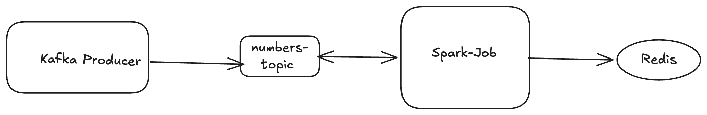

# topkSongs

## Architecture

### Step 1: Install Docker Desktop

Download and install Docker Desktop for Apple Silicon/Linex:

Docker Desktop for Mac (Apple Silicon)
https://www.docker.com/products/docker-desktop/?utm_source=chatgpt.com

docker --version
docker compose version

### Step 2: Start Kafka and Redis using Docker Compose

#### Start:

docker compose up -d

#### End: ( use it after the testing)
docker compose down -v

#### Verify:

docker ps

#### You should see:

kafka
redis
zookeeper

### Step 3: Create Kafka Topic

docker exec -it kafka bash

#### Inside container:

##### create topic:
kafka-topics --create  --topic numbers-topic  --bootstrap-server localhost:9092  --partitions 1  --replication-factor 1

##### List all topic:
kafka-topics --list  --bootstrap-server localhost:9092

#### Output:
numbers-topic

##### Start producing message in topic:
kafka-console-producer --bootstrap-server localhost:9092 --topic numbers-topic

### Step 5: Build

mvn clean package

### Step 6: Install Spark Locally

You don't actually need Spark installed. The dependencies in Maven download Spark libraries.

#### Run:

mvn exec:java -Dexec.mainClass=com.example.SparkKafkaRedisApp

Or You can run from intelIj

#### Add VM Args :
--add-exports=java.base/sun.nio.ch=ALL-UNNAMED --add-opens=java.base/java.nio=ALL-UNNAMED --add-opens=java.base/sun.nio.ch=ALL-UNNAMED

### Step 7: Produce Messages to Kafka

#### Open terminal:

docker exec -it kafka- bash

#### Start producer:

kafka-console-producer  --bootstrap-server localhost:9092 --topic numbers-topic

#### Push message in topic:

10

11

12

11

10

### Step 8: Verify Redis

### Open:
docker exec -it <redis-container-id> redis-cli

#### Get <redis-container-id> from below command
docker ps

#### Run:
ZRANGE topk 0 -1 WITHSCORES

#### Output:

1) "12"
2) "1"
3) "13"
4) "1"
5) "11"
6) "2"
7) "10"
8) "3"